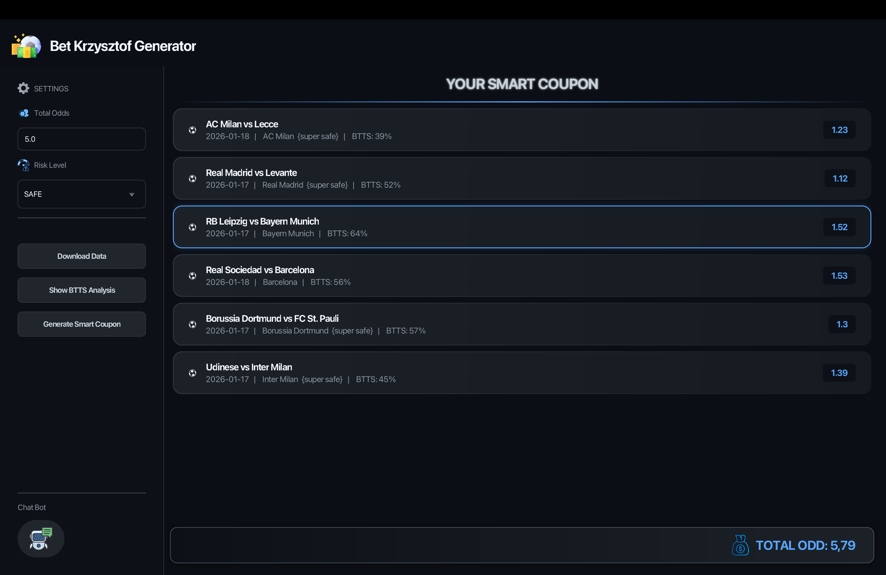
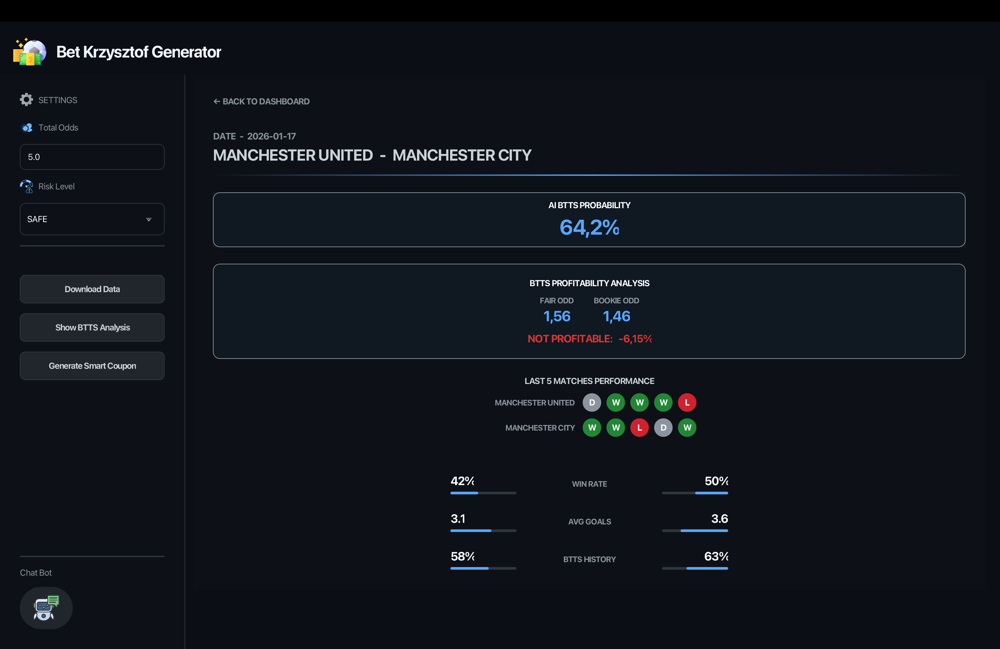
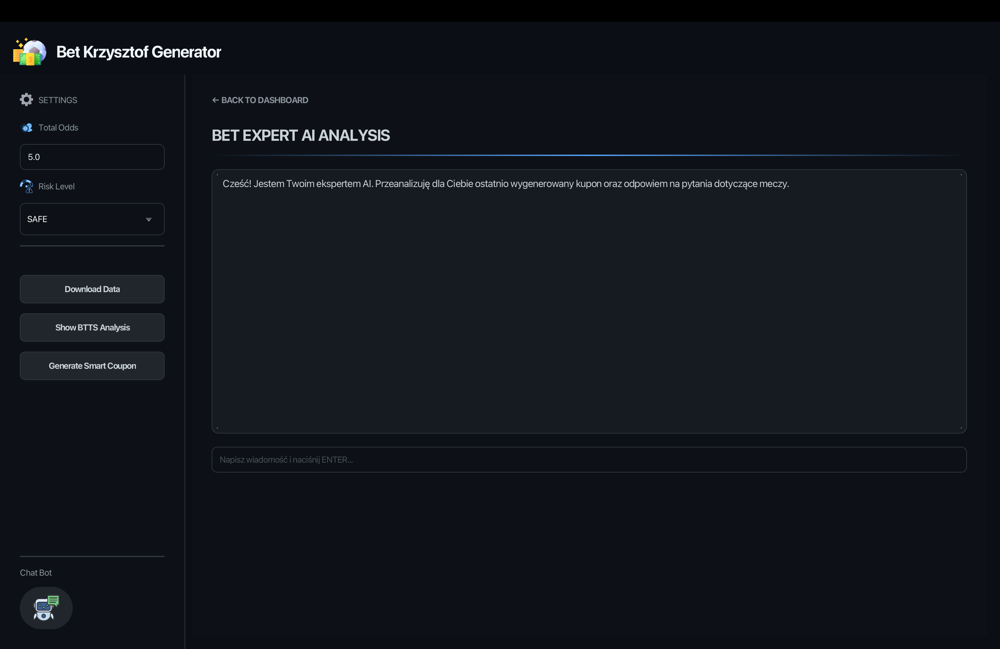
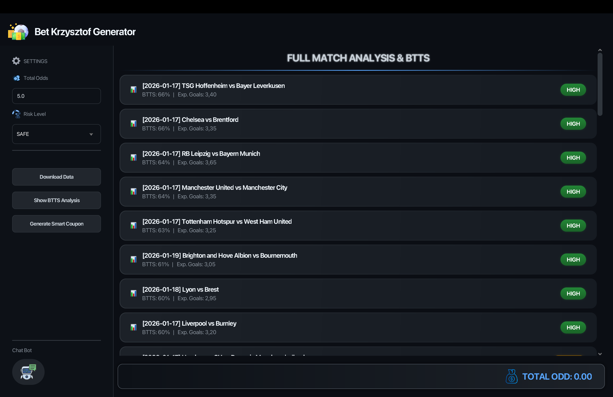

# ⚽ Betting Intelligence Dashboard


**Betting Intelligence Dashboard** is a high-performance desktop application designed for sophisticated sports data analysis and predictive modeling. The system integrates real-time market data with statistical algorithms and AI-driven insights to help users identify high-value betting opportunities.

---

## 📸 Dashboard Preview

|                             Main Interface                              | Match Detail Analysis |
|:-----------------------------------------------------------------------:|:---:|
|  |  |
|               *Modern Dark Mode UI with real-time stats*                | *Deep-dive into team form and xG* |


|              AI Chat Expert               |             BTTS Analysis View             |
|:-----------------------------------------:|:------------------------------------------:|
|           |         |
| *Interactive AI advice via Google Gemini* | *Detailed probability ranking for markets* |
---

## 🚀 Core Features

### 🧠 Smart Coupon Engine
* **Statistical Modeling**: Analyzes hundreds of matches based on Win Rate, BTTS (Both Teams To Score) probability, and Expected Goals (xG).
* **Risk Management**: Toggle between **SAFE**, **MEDIUM**, and **RISKY** strategy profiles.
* **Odds Targeting**: Dynamically assembles coupons to reach a user-defined total odd target.

### 📊 Comprehensive BTTS Analysis
* **Market Probability**: Calculates the likelihood of both teams scoring based on historical performance.
* **Match Status**: Categorizes games into HIGH, MEDIUM, or LOW probability zones for quick decision-making.

### 🤖 AI Expert Integration (Google Gemini)
* **Interactive Consultation**: A built-in AI chatbot that reviews your generated coupons and provides professional betting advice.
* **Data Interpretation**: Converts complex statistical data into natural language insights.

### ⚡ Performance & Caching
* **Local Data Management**: Stores JSON responses in a secure directory (`~/.betaidashboard`) to minimize API latency and save token usage.
* **Offline Access**: Allows for detailed analysis of previously downloaded data without an internet connection.

---

## 🛠️ Technical Stack

* **Language**: Java 17 (Modular System).
* **Framework**: JavaFX 21 with custom CSS (Modern Dark Mode).
* **Data Processing**: Jackson Databind for high-speed JSON parsing.
* **Network**: Asynchronous `HttpClient` for real-time odds retrieval.

---

## 📦 Installation & Setup

1. **API Keys Configuration**:
   Create `application.properties` in `src/main/resources/`:
   ```properties
   bet.api.key=YOUR_ODDS_API_KEY
   gemini.api.key=YOUR_GEMINI_API_KEY
   football.api.key = YOUR_MATCH_HISTORY_API_KEY
2. **Build Process**:
   In IntelliJ IDEA, navigate to: Build -> Build Artifacts -> Rebuild.
3. **Deployment (macOS)**: Run the automated update script from your terminal:
   ```Bash
   ./update_app.sh