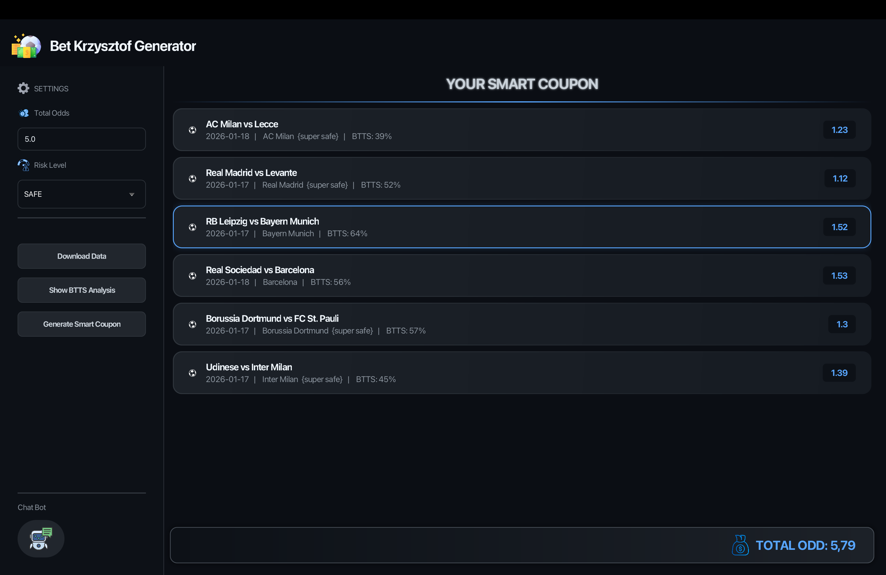
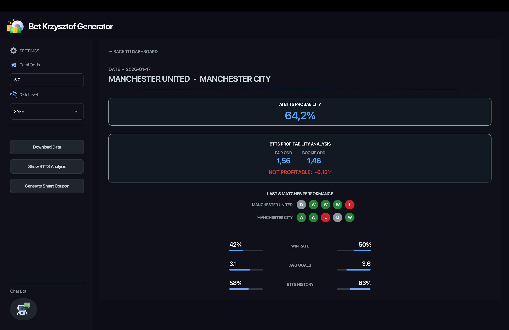
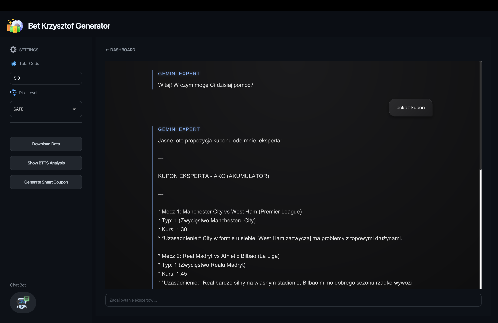
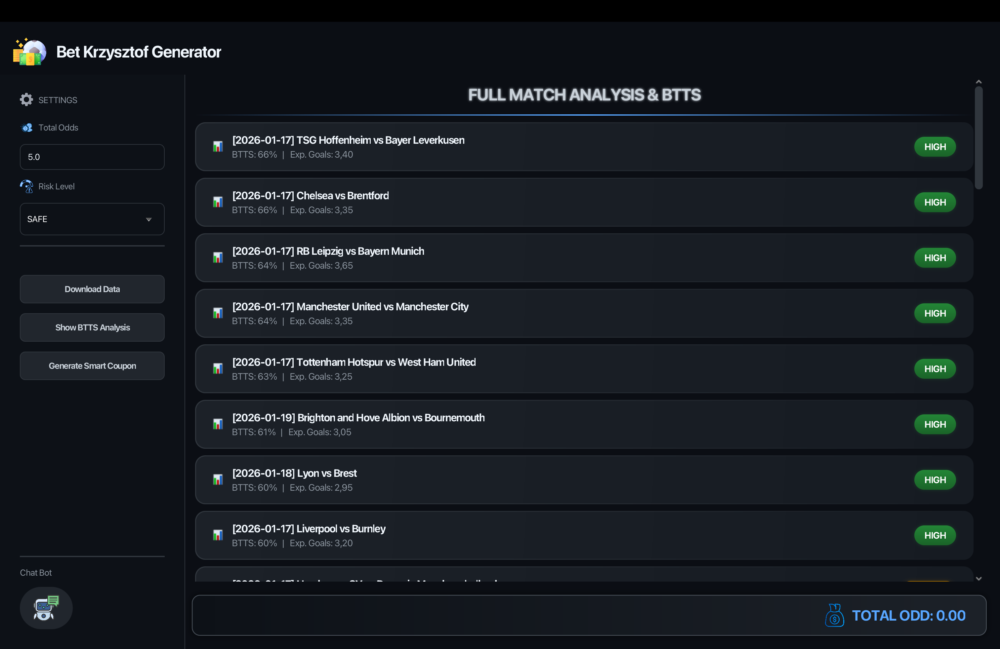

# Betting Intelligence Dashboard


**Betting Intelligence Dashboard** is a high-performance desktop application designed for sophisticated sports data analysis and predictive modeling. The system integrates real-time market data from major European leagues and the **UEFA Champions League** with statistical algorithms and AI-driven insights.

---

## Dashboard Preview

### Main Dashboard & Smart Coupon Generation

*Modern Dark Mode UI with real-time odds analysis and automated coupon assembly.*

### Deep Match Analysis & Form Tracking

*Deep-dive into team performance, historical win rates, and expected goal (xG) metrics.*

### Gemini AI Expert (Interactive Chat)

*Advanced AI consultation with a streaming UI, providing real-time analysis of your betting slips.*

### BTTS Market Probability Ranking

*Detailed probability modeling for "Both Teams To Score" markets across all supported leagues.*

---

## Quick Start Guide (No Coding Required)

Follow these steps to run the application directly without downloading the source code or using an IDE:

### 1. Prerequisites & Download
* Ensure you have **Java (JDK) 17 or newer** installed on your system.
* Navigate to the **Releases** section on the right side of this repository and download the `bet-generator.jar` file.
* Place the downloaded `.jar` file into a dedicated folder of your choice.

### 2. API Configuration
The application requires valid API keys to fetch live odds and power the AI Expert. In the same folder as the `.jar` file, create a text file named `application.properties` and paste the following lines, replacing the placeholders with your actual keys:

```properties
bet.api.key=YOUR_THE_ODDS_API_KEY
football.api.key=YOUR_RAPIDAPI_FOOTBALL_KEY
gemini.api.key=YOUR_GOOGLE_GEMINI_KEY
```
## API Keys

- **The Odds API**: Obtain your key at https://the-odds-api.com
- **API-Football**: Available via the RapidAPI platform
- **Gemini AI**: Generate a free or paid key at https://aistudio.google.com

---

## Running the Application

### macOS (Security Step Required)

macOS automatically restricts `.jar` files downloaded from the internet. To bypass this, follow these steps:

1. Open the **Terminal**.
2. Navigate to your application folder:
   ```bash
   cd <your-folder>
   ```

3. Execute the following command to remove the quarantine attribute:

   ```bash
   xattr -cr bet-generator.jar
   ```

4. Launch the application or just double click on the icon:

   ```bash
   java -jar bet-generator.jar
   ```

---

### Windows & Linux

Open your **Command Prompt (Windows)** or **Terminal (Linux)** in the application folder and run:

```bash
  java -jar bet-generator.jar
```

On **Windows**, you can typically launch the app by **double-clicking the `.jar` file** if your Java environment is correctly configured.

---

## Core Features

### Smart Coupon Engine
* **Multi-League Support**: Analysis for EPL, La Liga, Serie A, Bundesliga, Ligue 1, and **UEFA Champions League**.
* **Statistical Modeling**: Analyzes matches based on Win Rate, BTTS probability, and Expected Goals (xG).
* **Risk Management**: Toggle between **SAFE**, **MEDIUM**, and **RISKY** strategy profiles.
* **Odds Targeting**: Dynamically assembles coupons to reach a user-defined total odd target.

### AI Expert Integration (Google Gemini)
* **Interactive Consultation**: A built-in AI chatbot that reviews your generated coupons and provides professional betting advice.
* **Modern UI**: Features a professional, streaming response interface similar to the web version of Gemini.

### Performance & Caching
* **Local Data Management**: Stores JSON responses in a secure directory (`~/.betaidashboard`) to minimize API latency and save token usage.
* **Offline Access**: Allows for detailed analysis of previously downloaded data without an internet connection.

---

## Technical Stack

* **Language**: Java 17 (Modular System).
* **Framework**: JavaFX 21 with custom CSS & **WebView** for AI rendering.
* **Data Processing**: Jackson Databind for high-speed JSON parsing.
* **Network**: Asynchronous `HttpClient` for real-time odds retrieval.

---

## Installation & Setup

1. **Get API Keys**:
    * Odds data: [The Odds API](https://the-odds-api.com/)
    * AI: [Google AI Studio](https://aistudio.google.com/)

2. **Configuration**:
   Create `src/main/resources/application.properties` (use `application.properties.example` as a template):
   
    ```properties
    bet.api.key=YOUR_ODDS_API_KEY
    football.api.key=YOUR_RAPIDAPI_KEY
    gemini.api.key=YOUR_GEMINI_API_KEY
    ```